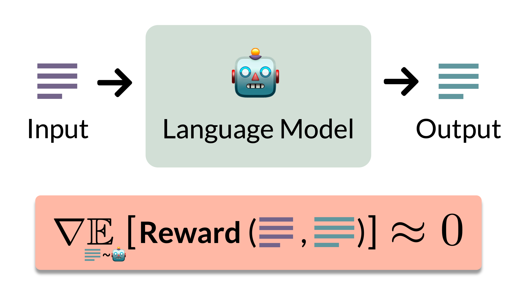

# Vanishing Gradients in Reinforcement Finetuning of Language Models (ICLR 2024)
Official implementation for the experiments in [Vanishing Gradients in Reinforcement Finetuning of Language Models](https://arxiv.org/abs/2310.20703) (ICLR 2024), based on the [PyTorch](https://pytorch.org/), [HuggingFace Transformers](https://huggingface.co/docs/transformers/index), and [RL4LMs](https://github.com/allenai/RL4LMs) libraries.

<p align="center">
  
</p>

## Installing Requirements

Tested with python 3.7.
- Install PyTorch from the [official website](https://pytorch.org/) (tested with version 1.11.0), including ```torchvision```.
- Install the remaining requirements using the ```update_env.sh``` script.

Alternatively, you can use the docker image and requirements.txt provided in the [RL4LMs](https://github.com/allenai/RL4LMs) library.

## 1. Experiments on the GRUE Benchmark (Sections 4 and 5)

Our experiments on the [GRUE](https://rl4lms.apps.allenai.org/grue)  benchmark are based on the [RL4LMs](https://github.com/allenai/RL4LMs) library.

### 1.1 Extracting Reward and Output Text Samples

For a GRUE dataset, the following command generates multiple output text samples per train example, computes their reward, and saves the results to a file.
```
python rl4lms_extract_samples_from_model_runner.py --config_path <config_path>
```
Replace ```<config_path>``` with one of the paths below according to the desired dataset.

| Dataset        | Configuration File Path                                                                                              |
|----------------|----------------------------------------------------------------------------------------------------------------------|
| NarrativeQA    | ```rl4lms_scripts/extract_samples/t5_narrative_qa_extract_samples.yml```                               |
| ToTTo          | ```rl4lms_scripts/extract_samples/t5_totto_extract_samples.yml```                                |
| CommonGen      | ```rl4lms_scripts/extract_samples/t5_commongen_extract_samples.yml```                                |
| IWSLT 2017     | ```rl4lms_scripts/extract_samples/t5_iwslt2017_extract_samples.yml``` |
| CNN/Daily Mail | ```rl4lms_scripts/extract_samples/t5_cnn_extract_samples.yml``` |
| DailyDialog    | ```rl4lms_scripts/extract_samples/gpt2_dialog_extract_samples.yml``` |
| IMDB           | ```rl4lms_scripts/extract_samples/gpt2_imdb_extract_samples.yml```    |


By default, the outputs will be generated using a pretrained model. To modify the model you can replace ```alg.model_name``` configuration with the HuggingFace model name of your choice or a directory with a HuggingFace model checkpoint.
Note that the reward mean and standard deviation scatter plots in the paper (e.g. Figure 1) were created based on the results of this command.

**Additional Notes:**
- The output will be saved under the directory specified by the ```output_path``` run argument (default is ```outputs/rl4lms_stats```).
- To modify the number of output samples generated per train example, change the ```evaluation.num_samples_per_input``` field in the configuration file (default is 10).
- To modify the number of train examples used, change the ```datapool.num_train_samples``` field in the configuration file (default is 5000).


### 1.2 Finetuning

The following command runs a single finetuning experiment based on the given configuration file.
```
python rl4lms_train_text_generation.py --config_path <config_path>
```
Replace ```<config_path>``` with the path to the desired finetuning configuration, which can be found under the ```rl4lms_scripts/training``` directory.

By default, finetuning is based on a pretrained model (either GPT-2 or T5-base). To modify the model you can replace the ```alg.model_name``` configuration with the HuggingFace model name of your choice or a directory with a HuggingFace model checkpoint.
Specifically, to perform an initial supervised finetuning phase before reinforcement finetuning, first finetune the pretrained model using the supervised finetuning configuration (e.g. ```rl4lms_scripts/training/narrative_qa/t5_supervised.yml``` for the NarrativeQA dataset). Then, set the model name in the "ppo_on_supervised" configuration (e.g. ```rl4lms_scripts/training/narrative_qa/t5_ppo_on_supervised.yml``` for running reinforcement finetuning using PPO on the NarrativeQA dataset) to the saved model checkpoint from the supervised finetuning run. 

**Additional Notes:**
- Results and model checkpoint will be saved under the directory specified by the ```base_path_to_store_results``` run argument (default is ```outputs/rl4lm```).
- Use the ```-h``` flag for information on the customizable run arguments.
- See the [RL4LMs GitHub page](https://github.com/allenai/RL4LMs/tree/main) for more information on the available configuration options and customization.


**Increasing learning rate, temperature, and entropy regularization (Section 5.1):**

- The learning rate can be modified via the ```alg.args.learning_rate``` field in the configuration file.
- The temperature can be modified via the ```policy.args.generation_kwargs.temperature``` field in the configuration file.
- The entropy regularization coefficient via the ```alg.args.ent_coef``` field in the configuration file.


**Reducing the number of supervised finetuning optimization steps and fraction of labeled samples (Section 5.2):**

- The maximal number of supervised finetuning optimization steps can be modified via the ```alg.training_args.max_steps``` field in the configuration file (default is -1, which means the number of steps is determined by the number of epochs and batch size).
- The fraction of training examples can be modified via the ```datapool.frac_train_samples``` field in the configuration file (default is -1, which means the whole training set will be used).


## 2. Controlled Experiments (Section 4.2)

### 2.1 Pretraining
```
python sft_vs_rft_controlled_experiments_plan_runner.py --plan_config_path <path_to_config_file>
```
Replace ```<path_to_config_file>``` with one of the paths below according to the desired experiment.

| Model and Dataset   | Configuration File Path                                                                                           |
|---------------------|-------------------------------------------------------------------------------------------------------------------|
| MLP on MNIST        | ```sft_vs_rft/experiment_plans/sft_vs_rft_mlp_mnist_pretrain_experiments_plan.json```                             |
| ResNet18 on CIFAR10 | ```sft_vs_rft/experiment_plans/sft_vs_rft_resnet_cifar_pretrain_experiments_plan.json```                          |
| BERT-mini on STS-B  | ```sft_vs_rft/experiment_plans/sft_vs_rft_bert_stsb_pretrain_experiments_plan.json``` |

**Additional Notes:**
- A folder with log files, metrics, and the model checkpoint will be automatically created under the directory specified by ```outputs_dir``` in the configuration file (default is ```outputs/controlled```).
- It is recommended to use a GPU by adding an available gpu id to the ```gpu_ids``` field in the configuration file.
- The different configuration options are documents in ```common/experiment/fit_experiment_base.py``` and ```sft_vs_rft/experiment/sft_vs_rft_controlled_experiment.py```.

### 2.2 Finetuning

```
python sft_vs_rft_controlled_experiments_plan_runner.py --plan_config_path <path_to_config_file>
```
Replace ```<path_to_config_file>``` with one of the paths below according to the desired experiment.

| Model and Dataset                          | Configuration File Path                                                                                              |
|--------------------------------------------|----------------------------------------------------------------------------------------------------------------------|
| MLP on MNIST w/ Adam                       | ```sft_vs_rft/experiment_plans/sft_vs_rft_mlp_mnist_finetune_experiments_plan.json```                                |
| MLP on MNIST w/ SGD                        | ```sft_vs_rft/experiment_plans/sft_vs_rft_mlp_mnist_finetune_sgd_experiments_plan.json```                                |
| MLP on MNIST w/ High Initial Reward        | ```sft_vs_rft/experiment_plans/sft_vs_rft_mlp_mnist_finetune_high_init_reward_experiments_plan.json```                                |
| ResNet18 on CIFAR10 w/ Adam                | ```sft_vs_rft/experiment_plans/sft_vs_rft_resnet_cifar_finetune_experiments_plan.json``` |
| ResNet18 on CIFAR10 w/ SGD                 | ```sft_vs_rft/experiment_plans/sft_vs_rft_resnet_cifar_finetune_sgd_experiments_plan.json``` |
| ResNet18 on CIFAR10 w/ High Initial Reward | ```sft_vs_rft/experiment_plans/sft_vs_rft_resnet_cifar_finetune_high_init_reward_experiments_plan.json``` |
| BERT-mini on STS-B w/ Adam                 | ```sft_vs_rft/experiment_plans/sft_vs_rft_bert_stsb_finetune_experiments_plan.json```    |
| BERT-mini on STS-B w/ SGD                  | ```sft_vs_rft/experiment_plans/sft_vs_rft_bert_stsb_finetune_sgd_experiments_plan.json```    |
| BERT-mini on STS-B w/ High Initial Reward  | ```sft_vs_rft/experiment_plans/sft_vs_rft_bert_stsb_finetune_high_init_reward_experiments_plan.json```    |


In the chosen configuration file, set the ```load_model_from_checkpoint``` field to the path of the checkpoint created during pretraining.

**Additional Notes:**
- Make sure that the ```samples_rnd_seed``` configuration is the same as that used for pretraining, so that the data generation process for finetuning will be consistent with that for pretraining.
- The configuration ```opt_method``` determines which type of finetuning is conducted. By default, the included configurations will run two experiments, one with supervised finetuning (```supervised```) and one with reinforcement finetuning using expected gradients (```expected_reinforce```).
- A folder with log files, metrics, and the model checkpoint will be automatically created under the directory specified by ```outputs_dir``` in the configuration file (default is ```outputs/controlled```).
- It is recommended to use a GPU by adding an available gpu id to the ```gpu_ids``` field in the configuration file.
- The different configuration options are documented in ```common/experiment/fit_experiment_base.py``` and ```sft_vs_rft/experiment/sft_vs_rft_controlled_experiment.py```.


## Citation

For citing the paper you can use:
```
@inproceedings{razin2024vanishing,
  title={Vanishing Gradients in Reinforcement Finetuning of Language Models},
  author={Razin, Noam and Zhou, Hattie and Saremi, Omid and Thilak, Vimal and Bradley, Arwen and Nakkiran, Preetum and Susskind, Joshua and Littwin, Etai},
  booktitle={International Conference on Learning Representations},
  year={2024}
}
```
